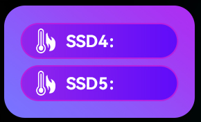

# Sensor Mode 3 Progress

A progress sensor crops a progress image based on the corresponding sensor value and alpha-blends it with the panel image.

Sensor configuration fields:
- `mode`: 3 (for progress)
- `label`: label identifier, also used as sensor value data source identifier
- `direction`: 1 = left to right, 2 = right to left, 3 = top to bottom, 4 = bottom to top
- `x`, `y`: position on the panel
- `pic`: progress image to crop and overlay
- `minValue`, `maxValue`: clamp sensor value to this range

## Example

Example `panel.json` with two "progress" indicator sensor and the following (partial) background image in `img`:



The background image and sensor definitions are taken from the default system panel configuration in the AOOSTAR-X app.

```json
{
  "name": "Progress test panel",
  "img": "background.png",
  "sensor": [
    {
      "mode": 3,
      "type": 2,
      "name": "SSD 4 usage",
      "label": "storage_ssd4_usage",
      "x": 400,
      "y": 45,
      "direction": 1,
      "value": "35",
      "fontFamily": "HarmonyOS_Sans_SC_Bold",
      "fontSize": 24,
      "fontColor": -1,
      "textAlign": "center",
      "minValue": 0,
      "maxValue": 100,
      "pic": "progress.png"
    },
    {
      "mode": 3,
      "type": 2,
      "name": "SSD 5 usage",
      "label": "storage_ssd5_usage",
      "x": 400,
      "y": 106,
      "direction": 1,
      "value": "80",
      "fontFamily": "HarmonyOS_Sans_SC_Bold",
      "fontSize": 24,
      "fontColor": -1,
      "textAlign": "center",
      "minValue": 0,
      "maxValue": 100,
      "pic": "progress.png"
    },
    {
      "mode": 1,
      "type": 2,
      "name": "SSD 4 temp",
      "label": "storage_ssd4_temperature",
      "x": 580,
      "y": 70,
      "direction": 1,
      "value": "34",
      "fontFamily": "HarmonyOS_Sans_SC_Bold",
      "fontSize": 24,
      "fontColor": -1,
      "textAlign": "center",
      "integerDigits": -1,
      "decimalDigits": 0,
      "unit": " ℃"
    },
    {
      "mode": 1,
      "type": 2,
      "name": "SSD 5 temp",
      "label": "storage_ssd5_temperature",
      "x": 580,
      "y": 130,
      "direction": 1,
      "value": "35",
      "fontFamily": "HarmonyOS_Sans_SC_Bold",
      "fontSize": 24,
      "fontColor": -1,
      "textAlign": "center",
      "integerDigits": -1,
      "decimalDigits": 0,
      "unit": " ℃"
    }
  ]
}
```

Progress image `"pic": "progress.png"`:


The following graphic is rendered for progress example above:


## Known Issues

Progress sensor rendering has been reverse engineered from the AOOSTAR-X app. Not all options are supported.

- Work in progress, not yet fully tested
- `widht`, `height` should be considered and auto-resized as for mode 4
