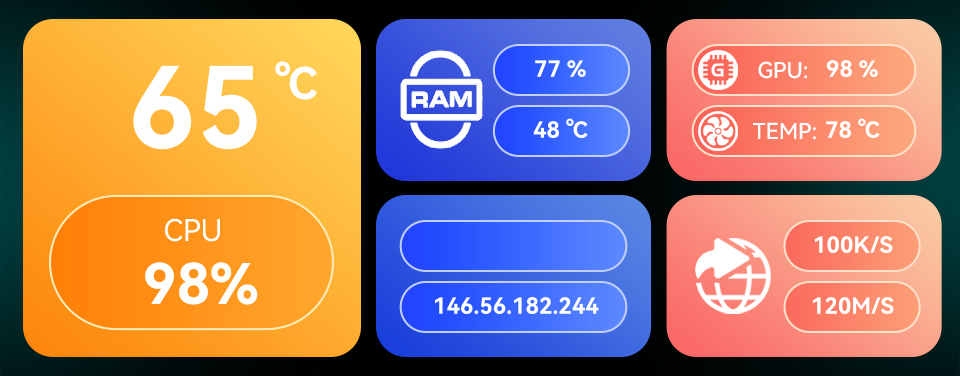

# Sensor Panels

The `asterctl` tool is started in sensor panel mode if the `--config` command line option is specified.

Sensor panels are dynamic screens showing various sensor values. Multiple rotating panels are supported. 
The sensor values must be provided in simple key-value text files from external scripts or tools. The `asterctl` tool
is only responsible for rendering the panels on the embedded screen.

Example panels from the AOOSTAR-X software, rendered with `asterctl` using dummy sensor values:




## Supported Features

- One or multiple panels rotating in configurable interval (configuration value `setup.switchTime`).
- Each panel can be configured with multiple sensor fields.
  - Text sensor value fields are supported (`sensor.mode: 1`), but there are still some text size and positioning issues.
  - Fan (2), progress (3) and pointer (4) sensor modes are being worked on and not all configuration options are working yet.
- Each sensor field can be customized with an individual font, size, color and text alignment.
- Panels are redrawn at a configurable interval (configuration value `setup.refresh`).
  - Only the updated areas of the image are sent to the display for faster updates.

## Panel Configuration File

Specify configuration file to use:
```shell
asterctl --config monitor.json
```

- The configuration file is loaded from the configuration directory if not an absolute path is specified.
- The default configuration directory is `./cfg` and can be changed with the `--config-dir` command line option.

The original AOOSTAR-X json configuration file format is used, but only a subset of the configuration is supported:

- Setup object fields:
  - `switchTime`: Optional switch time between panels in seconds, string value interpreted as float and converted to milliseconds. Default: 5
  - `refresh`: Panel redraw interval in seconds specified as a float number. Default: 1
- Panel object fields in `diy[]`:
  - `img`: Background image filename. Loaded from the specified configuration directory if not an absolute path is specified.
  - `sensor`: Array of sensor objects.
- Sensor object fields:
  - `label`: label identifier, also used as sensor value data source identifier
  - `integerDigits`: sensor value format option: number of integer places. Value is 0-prefixed to number of places and set to `99` if overflown.
  - `decimalDigits`: sensor value format option: number of decimal places.
  - `unit`: optional unit label, appended after the sensor value
  - `x`: x-position
  - `y`: y-position
  - `fontFamily`: Font name matching font filename without file extension. Fonts are loaded from the configured font directory.
  - `fontSize`: Font size
  - `fontColor`: Font color in `#RRGGBB` notation, or `-1` if not set. Examples: `#ffffff` = white, `#ff0000` = red. Default: `#ffffff` 
  - `textAlign`: Text alignment: `left`, `right`, `center`
  - Fields used for the fan (2), progress (3) and pointer (4) sensor modes:
    - `min_value` and `max_value`
    - `width` and `height`
    - `direction`
    - `pic`: progress image, loaded from the specified configuration directory if not an absolute path is specified.
    - `min_angle` and `max_angle`
    - `xz_x` and `xz_y`

Example configuration file: [cfg/monitor.json](../cfg/monitor.json).

Sensor values are not read from the configuration file (the `sensor.value` field is ignored). See data sources below.

More options might be supported later.

### Custom Panels

By default, the defined panels in the main configuration file are loaded and rendered.

Additional custom panels can be included with the `--panels` command line parameter.

A custom panel consists of:
- a `panel.json` file with just the json object of the `diy` array of the main configuration file.
- `img` subdirectory containing the referenced images in `panel.json`
- `fonts` subdirectory containing the referenced fonts in `panel.json`

There are lots of custom panel configurations available online.
AOOSTAR support sent the following link: <http://pan.sztbkj.com:5244/>

Example:
```shell
asterctl --config monitor.json --panels cfg/01_custom --panels cfg/02_custom
```

## Sensor Data Sources

Sensor values are provided in separate text files and are automatically read when the file changes.
Only the file data source is supported at the moment, other sources like pipes, sockets etc. might be supported later.

### Text File Data Source

- Text file with ending: `.txt`
- Simple key / value pairs, separated by a colon `:`. Example: `foo: bar`
- Line based: one key / value per line.
- Key and value are trimmed. Any whitespace will be removed.
- Empty lines and comments are ignored.
- Comments start with `#` at the beginning of the line.
- Support for special keys: if key ends with `#unit` then the value is the unit for the corresponding key before the suffix
    - Example: `net_download_speed#unit: M/S` is the unit value for `net_download_speed`.
    - This can be used for dynamic unit values if they sensor value provider cannot add the unit to the corresponding value.
- File contents will automatically be read when updated.
    - This requires the sensor value provider to use atomic file updates!
    - Best practice is to use a temporary file on the same filesystem and use a move or rename operation after all values have been written.
- One or multiple sensor text files are supported.
    - Either a single file can be specified, or a directory path.
    - If a directory is specified, all children matching the sensor file naming pattern will be read and monitored.
    - Any subdirectories are ignored (no recursive support).

Example text file for the [cfg/monitor.json](../cfg/monitor.json) panel configuration:

<details>

```
cpu_temperature: 65
cpu_percent: 98
memory_usage: 77
memory_Temperature: 48
net_ip_address: 146.56.182.244
gpu_core: 98
gpu_temperature: 78
net_upload_speed: 100
net_upload_speed#unit: K/S
net_download_speed: 120
net_download_speed#unit: M/S
motherboard_temperature: 38
storage_ssd[0]['temperature']: 31
storage_ssd[0]['used']: 17
storage_ssd[1]['temperature']: 32
storage_ssd[1]['used']: 27
storage_ssd[2]['temperature']: 33
storage_ssd[2]['used']: 37
storage_ssd[3]['temperature']: 34
storage_ssd[3]['used']: 47
storage_ssd[4]['temperature']: 35
storage_ssd[4]['used']: 57
storage_hdd[0]['temperature']: 36
storage_hdd[0]['used']: 17
storage_hdd[1]['temperature']: 37
storage_hdd[1]['used']: 27
storage_hdd[2]['temperature']: 38
storage_hdd[2]['used']: 37
storage_hdd[3]['temperature']: 39
storage_hdd[3]['used']: 47
storage_hdd[4]['temperature']: 40
storage_hdd[4]['used']: 57
storage_hdd[5]['temperature']: 10
storage_hdd[5]['used']: 67
```

</details>

### Shell Scripts

The [/linux/scripts](../linux/scripts) directory contains some proof-of-concept Linux shell scripts.

CPU and memory usage are written into a sensor data source text file that can be used by `asterctl`.

```
./cpu_usage.sh -h
Simple PoC script to periodically write the CPU usage into a sensor text file.

Usage:
./cpu_usage.sh [-r REFRESH] [-s SENSOR_FILE] [-t TEMP_DIR]

  -r REFRESH     refresh in seconds.  Default: 1
  -s SENSOR_FILE output sensor file.  Default: /tmp/sensors/cpu.txt
  -t TEMP_DIR    temporary directory. Default: /tmp
```

```
./mem_usage.sh -h
Simple PoC script to periodically write the memory usage into a sensor text file.

Usage:
./mem_usage.sh [-r REFRESH] [-s SENSOR_FILE] [-t TEMP_DIR]

  -r REFRESH     refresh in seconds.  Default: 5
  -s SENSOR_FILE output sensor file.  Default: /tmp/sensors/mem.txt
  -t TEMP_DIR    temporary directory. Default: /tmp
```

### sysinfo Tool

The Rust based [/src/bin/sysinfo.rs](../src/bin/sysinfo.rs) tool gathers many more system sensor values with the help of
the [sysinfo](https://github.com/GuillaumeGomez/sysinfo) crate.

It supports FreeBSD, Linux, macOS, Windows and other OSes, but it has only been tested on Linux so far.

```
Proof of concept sensor value collection for the asterctl screen control tool

Usage: sysinfo [OPTIONS]

Options:
  -o, --out <OUT>
          Output sensor file

  -t, --temp-dir <TEMP_DIR>
          Temporary directory for preparing the output sensor file.
          
          The system temp directory is used if not specified.
          The temp directory must be on the same file system for atomic rename operation!

      --console
          Print values in console

  -r, --refresh <REFRESH>
          System sensor refresh interval in seconds

      --disk-refresh <DISK_REFRESH>
          Enable individual disk refresh logic as used in AOOSTAR-X. Refresh interval in seconds

      --smartctl
          Retrieve drive temperature if `disk-update` option is enabled.
          
          Requires smartctl and password-less sudo!
```

Single test run with printing all sensors on the console:
```shell
sysinfo --console
```

Normal mode providing sensor values for `asterctl` in `/tmp/sensors/sysinfo.txt`:

```shell
sysinfo --refresh 3 --out /tmp/sensor/sysinfo.txt
```

Note: the lower the refresh rate, the more resources are used!
