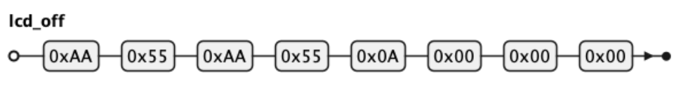
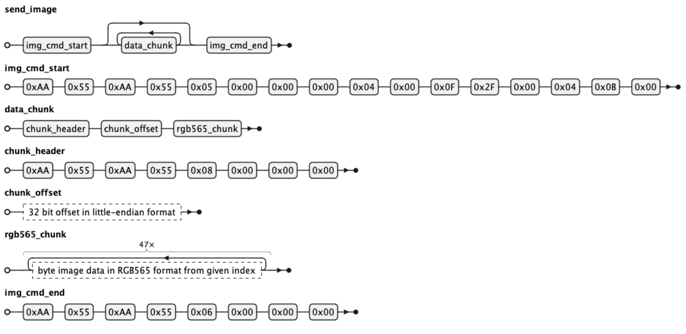

# LCD Protocol

This page contains the current state of the reverse engineered AOOSTAR display protocol.

See [Linux shell commands](shell_commands.md) how you can switch the display on and off with standard Linux commands.

- **Resolution:** 960 × 376
- **Manufacturer:** Synwit
- **Connected over USB UART** with a proprietary serial communication protocol:
    - **USB device ID:** `416:90A1` (as shown by `lsusb`)
    - **Linux device (example on Debian):** `/dev/ttyACM0`
    - **1,500,000 baud**, 8N1 (likely ignored; actual USB transfer speed is much higher)

## Display Off

**Request:**


<details>

```
@startebnf lcd_off
lcd_off = 0xAA, 0x55, 0xAA, 0x55, 0x0A, 0x00, 0x00, 0x00 ;
@endebnf
```

</details>

**Response:**
- Success: character `A`
- Error: _unknown_

## Display On

**Request:**


<details>

```
@startebnf lcd_on
lcd_on = 0xAA, 0x55, 0xAA, 0x55, 0x0B, 0x00, 0x00, 0x00 ;
@endebnf
```

</details>

**Response:**
- Success: character `A`
- Error: _unknown_

Note:
- When switching the display on, the last displayed image is immediately shown.

## Display Image

**Request:**


<details>

```
@startebnf send_image
send_image = img_cmd_start, { data_chunk }, img_cmd_end ;

img_cmd_start = 0xAA, 0x55, 0xAA, 0x55, 0x05, 0x00, 0x00, 0x00, 0x04, 0x00, 0x0F, 0x2F, 0x00, 0x04, 0x0B, 0x00 ;
data_chunk = chunk_header, chunk_offset, rgb565_chunk ;
chunk_header = 0xAA, 0x55, 0xAA, 0x55, 0x08, 0x00, 0x00, 0x00 ;
chunk_offset = ? 32 bit offset in little-endian format ? ;
rgb565_chunk = 47 * ? byte image data in RGB565 format from given index ?;
img_cmd_end = 0xAA, 0x55, 0xAA, 0x55, 0x06, 0x00, 0x00, 0x00 ;
@endebnf
```

</details>

**Response:**
- Success: character `A`
- Error: _unknown_

Notes:
- When sending an image to the screen, the image must be in **RGB565** format (16 bits per pixel).
  - `asterctl` performs all graphic operations on an RGB888 image buffer.
  - `asterctl` automatically converts the image to RGB565 when sending it to the display.
- The 1.5 Mbps baud rate set in the client is ignored, as actual USB bulk transfer achieves much higher throughput.
  For reference, at the nominal serial rate (~1,500,000 baud), it would take approximately 6 seconds to transfer a full image of 721,920 bytes (960 × 376 × 2):
  - Display protocol: payload per chunk = 47 bytes; header per chunk = 12 bytes
  - Number of chunks: 721,920 / 47 ≈ 15,360 chunks
  - Total transmitted data: 15,360 chunks × 59 bytes/chunk = 906,240 bytes
  - Serial frame format: 1 start bit + 8 data bits + 1 stop bit = 10 bits/byte
  - Effective byte rate: 1,500,000 bits/sec / 10 bits/byte = 150,000 bytes/sec
  - Transfer time: 906,240 bytes / 150,000 bytes/sec ≈ 6 seconds
- **Performance:**
  - Displaying the first fullscreen image takes around 1.3 seconds.
  - Once the new image is fully transferred and the end-header command is sent, the display firmware switches to the new image.
- **Partial Updates:**
  - `asterctl` uses a frame cache to send only changed chunks after the initial image is displayed, greatly speeding up partial screen updates.
  - The chunk size is 47 bytes, determined from the original app. It is unknown if other chunk sizes are supported.
  - There are no fractional chunks: 960x376 x 2 bytes/pixel / 47 bytes/chunk = 15360 chunks
