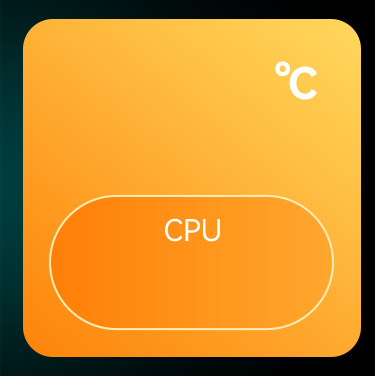
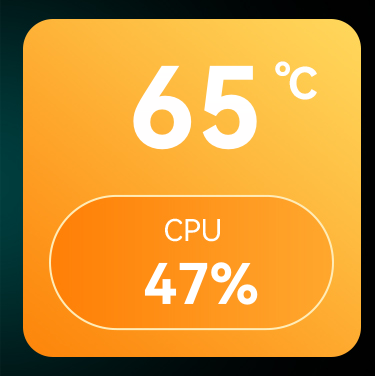

# Sensor Mode 1 Text

A text sensor renders a text label with a sensor value and an optional unit text on the panel. 
The value can be formatted as a fixed point decimal number or as an integer.

Text sensor configuration fields:
- `mode`: 1 (for text)
- `label`: label identifier, also used as sensor value data source identifier
- `direction`: 1 = left to right, 2 = right to left, 3 = top to bottom, 4 = bottom to top
- `label`: data source id to retrieve the current value from
- `unit`: optional unit label, appended after the sensor value 
- `x`, `y`: position on the panel
- `fontFamily`: Font name matching font filename without file extension.
  - Fonts are loaded from the configured font directory, or from the custom panel's `fonts` directory. 
  - An absolute file path can also be used.
- `fontSize`: Font size
- `fontColor`: Font color in `#RRGGBB` notation, or `-1` if not set.
  - Examples: `#ffffff` = white, `#ff0000` = red. Default: `#ffffff`
- `textAlign`: Text alignment: `left`, `center`, `right`
- `integerDigits`: number of integer digits: -1 or missing field = all digits, > 0 prefix with `0` and set to `9` if overflown
- `decimalDigits`: number fixed point digits: -1 = auto, 0 = integer number without decimal digits, > 0 fixed number of decimal digits

## Value Formatting

The sensor value can be formatted with the `unit` and `integerDigits` & `decimalDigits` options.

- The unit value is simply appended to the value, without whitespace.
- Example formatting for the value `123.456` with `integerDigits` & `decimalDigits`:

| integer | decimal | output   |
|---------|---------|----------|
| 5       | 2       | 00123.46 |
| 5       | 1       | 00123.5  |
| 5       | 0       | 00123    |
| -1      | 2       | 123.46   |
| -1      | 1       | 123.5    |
| -1      | 0       | 123      |
| 2       | 0       | 99       |


## Example

Example `panel.json` with two "text" indicator sensors and the following (partial) background image in `img`:



The background image and sensor definitions are taken from the default system panel configuration in the AOOSTAR-X app.

```json
{
  "name": "Text test panel",
  "img": "background.png",
  "sensor": [
    {
      "mode": 1,
      "name": "CPU temp",
      "label": "cpu_temperature",
      "x": 195,
      "y": 110,
      "value": "65",
      "fontFamily": "HarmonyOS_Sans_SC_Bold",
      "fontSize": 120,
      "fontColor": -1,
      "textAlign": "center",
      "decimalDigits": 0
    },
    {
      "mode": 1,
      "name": "CPU usage",
      "label": "cpu_percent",
      "unit": "%",
      "x": 200,
      "y": 285,
      "value": "47.4",
      "fontFamily": "HarmonyOS_Sans_SC_Bold",
      "fontSize": 60,
      "fontColor": -1,
      "textAlign": "center",
      "decimalDigits": 0
    }
  ]
}
```

The following graphic is rendered for the two text fields defined above:



## Known Issues

Text sensor formatting has been reverse engineered from the AOOSTAR-X app. Not all options are supported

- Text position and font size calculation doesn't always match AOOSTAR-X.
  - Needs investigation if value is in pixel or points.
  - Might also need dpi adjustments.
- `fontWeight` not yet supported.
