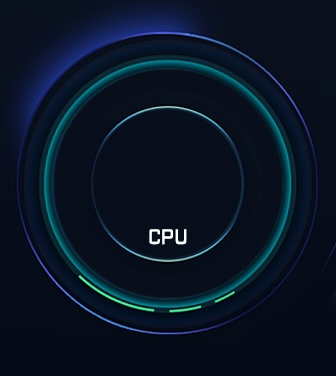
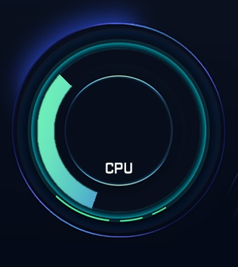

# Sensor Mode 2 Circular Progress

A circular progress sensor (known as `fan` in the AOOSTAR-X software) masks a progress bar image for a certain angular
range based on the corresponding sensor value. The masked image is alpha-blended with the panel image.

Sensor configuration fields:
- `mode`: 2 (for fan)
- `direction`: 1 = clockwise, 2 = counter-clockwise
- `label`: label identifier, also used as sensor value data source identifier
- `x`, `y`: position on the panel
- `width`, `height`: size of the circular progress element (not yet used)
- `pic`: circular progress image to overlay. Should match `width`, `height`
- `minAngle`, `maxAngle`: range of the masked image
- `minValue`, `maxValue`: clamp sensor value to this range
- `xz_x`, `xz_y`

## Example

The following configuration and graphics are taken from the `仪表盘_windows` panel configuration in `有线网卡 windows驱动.rar`.

Example `panel.json` with a single "fan" indicator sensor and the following (partial) background image in `img`:



```json
{
  "name": "Fan test panel",
  "img": "background.jpg",
  "sensor": [
    {
      "id": "29d9ef2d-30b4-459d-b2b0-43cb6d4d6b41",
      "itemName": "CPU usage",
      "mode": 2,
      "direction": 1,
      "label": "cpu_percent",
      "value": "47.7",
      "x": 168,
      "y": 184,
      "width": 237,
      "height": 237,
      "minAngle": -160,
      "maxAngle": 30,
      "minValue": 0,
      "maxValue": 80,
      "xz_x": 0,
      "xz_y": 0,
      "pic": "progress_circle.png"
    }
  ]
}
```

Progress image `"pic": "progress_circle.png"`:


The following graphic is rendered for progress example above:




## Known Issues

Fan sensor rendering has been reverse engineered from the AOOSTAR-X app. Not all options are supported.

- Work in progress, not yet fully tested
- `direction: 2` doesn't seem to work
- `widht`, `height` should be considered and auto-resized as for mode 4

