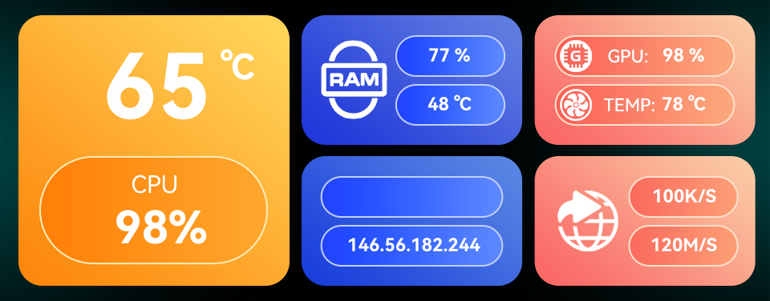
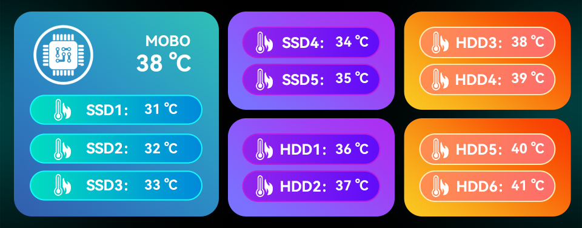

# Sensor Panels

The `asterctl` tool is started in sensor panel mode if the `--config` command line option is specified.

Sensor panels are dynamic screens showing various sensor values. Multiple rotating panels are supported. 
The sensor values must be provided in simple key-value text files from external scripts or tools. The `asterctl` tool
is only responsible for rendering the panels on the embedded screen.

Example panels from the AOOSTAR-X software, rendered with `asterctl` using dummy sensor values:

See [custom sensor panels](custom_panel.md) for including custom panels.

## Supported Features

- One or multiple panels rotating in configurable interval (configuration value `setup.switchTime`).
- Each panel can be configured with multiple sensor fields.
  - Text sensor value fields are supported (`sensor.mode: 1`), but there are still some text size and positioning issues.
  - Fan (2), progress (3) and pointer (4) sensor modes are being worked on and not all configuration options are working yet.
- Each sensor field can be customized with an individual font, size, color and text alignment.
- Panels are redrawn at a configurable interval (configuration value `setup.refresh`).
  - Only the updated areas of the image are sent to the display for faster updates.

See [Sensor Configuration](cfg/) for more information.
